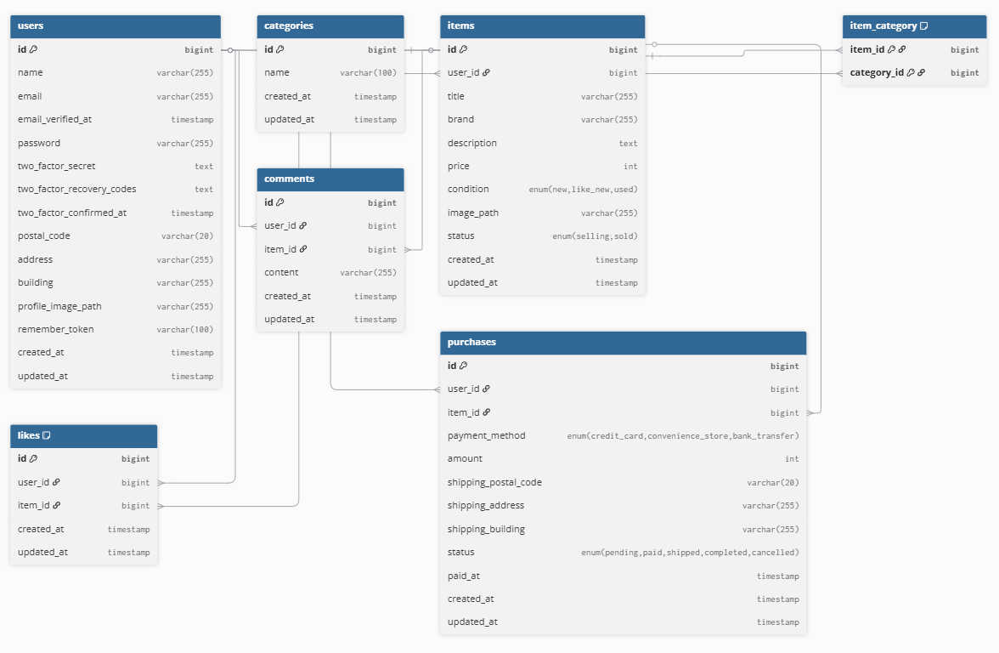

# Freamarket

## 環境構築

### Docker ビルド

1. git clone git@github.com:starmine448357/freamarket.git
1. cd freamarket
1. docker compose up -d --build

&nbsp;&nbsp;&nbsp;&nbsp;&nbsp;※MySQL は、OS によって起動しない場合があるので、それぞれの PC に合わせて docker-compose.yml ファイルを編集してください。

### Laravel 環境構築

1. docker compose exec app bash
1. composer install
1. cp .env.example .env
1. .env ファイルの一部を以下のように編集

DB_HOST=mysql
DB_PORT=3306
DB_DATABASE=laravel_db
DB_USERNAME=laravel_user
DB_PASSWORD=laravel_pass

6. php artisan key:generate  
7. php artisan migrate:fresh --seed  
8. php artisan storage:link  

---

## ユーザー登録について

初期ユーザーは作成されません。  
ログインするには、最初に `/register` から新規登録を行ってください。

---

## 使用技術

- MySQL 8.0.x  
- PHP 8.2.x-fpm  
- Laravel 10.x  
- Docker  

---

## URL

- 開発環境: http://localhost:8080/  
- phpMyAdmin: http://localhost:8082/  
- Mailhog: http://localhost:8025/  

---

## Stripeについて

.env.example に記載している Stripe のキーはダミー値です。  
そのため、購入処理を実行すると以下のようなエラーが表示されますが、これは正常な挙動です。

決済の開始に失敗しました: Invalid API Key provided

---

## ER 図

